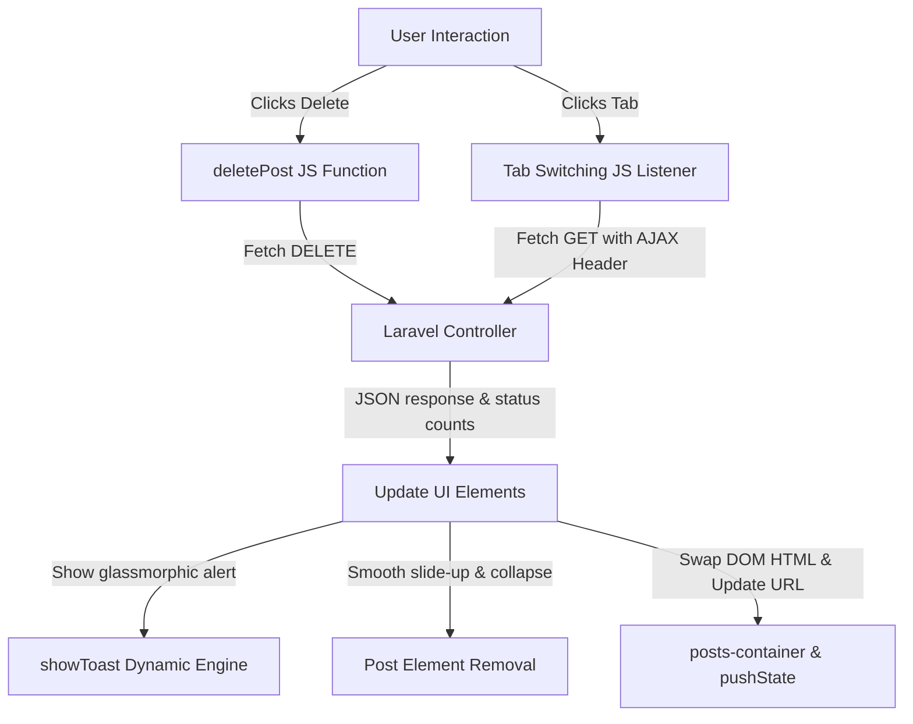

# 🚀 Mastering Modern JavaScript: Interactive Toast Systems & Page-Reload-Free Workflows

This document is a comprehensive guide to understanding, building, and mastering the modern, responsive JavaScript features implemented in your blog platform. It covers everything from DOM creation and timer lifecycles to asynchronous network calls (Fetch API), CSRF security, smooth layout transitions, and browser history synchronization.

---

## 🧭 Roadmap of the Interactivity Suite

We transitioned this application from traditional, synchronous page reloads and standard browser alert dialogs into a highly fluid, responsive SPA (Single Page Application) experience using three layers:



---

## 🛠️ Chapter 1: The Glassmorphic Toaster Engine (`toasts.blade.php`)

Let's dissect the implementation inside `resources/views/layouts/includes/toasts.blade.php`.

### 1. The HTML Structure
We start with a silent, invisible layout anchor that acts as a portal for our toasts:
```html
<div id="toast-container" class="fixed bottom-5 right-5 z-[9999] flex flex-col gap-3 max-w-sm w-full px-4 sm:px-0 pointer-events-none">
    <!-- Dynamic toasts will render here -->
</div>
```
* **`fixed bottom-5 right-5`**: Keeps the container locked in the viewport regardless of scrolling.
* **`pointer-events-none`**: **Critical detail!** Because this container overlaps page content, this class allows mouse clicks to pass through it so it doesn't block underlying buttons or links. We will manually enable `pointer-events-auto` on individual toasts so you can click close buttons.

---

### 2. The `showToast` Mechanism
Here is the core JS function:
```javascript
function showToast(message, type = 'success') {
    const container = document.getElementById('toast-container');
    if (!container) return;

    // 1. Create a fresh DOM element
    const toast = document.createElement('div');
    toast.className = `pointer-events-auto relative overflow-hidden flex items-start gap-3 p-4 rounded-xl shadow-xl border bg-white/95 backdrop-blur-md border-slate-100 transition-all duration-300 ease-out transform translate-x-full opacity-0 w-full`;
```

#### 💡 Key Concept: `document.createElement('div')`
Instead of using slow, insecure `innerHTML` appending directly on the container (which destroys existing event listeners), we use standard DOM manipulation. `document.createElement` builds a virtual DOM element in memory, allowing us to customize its properties cleanly before injecting it.

#### 💡 Key Concept: Micro-Animations & Tailwind
Notice the classes `transition-all duration-300 ease-out transform translate-x-full opacity-0`.
* We start the element hidden offscreen (`translate-x-full`) and completely transparent (`opacity-0`).
* We add `pointer-events-auto` here so users can interact with this toast card (such as clicking the close button).

---

### 3. Dynamic Styling & Content
```javascript
    let icon = 'check_circle';
    let iconColor = 'text-emerald-500 bg-emerald-50';
    let progressColor = 'bg-emerald-500';

    if (type === 'error') {
        icon = 'error';
        iconColor = 'text-rose-500 bg-rose-50';
        progressColor = 'bg-rose-500';
    } // ... handling warning and info similarly
```
We resolve the icon names and colors dynamically based on the argument passed.

```javascript
    toast.innerHTML = `
        <div class="flex-shrink-0 p-1.5 rounded-lg ${iconColor} flex items-center justify-center">
            <span class="material-symbols-outlined text-[20px] font-bold">${icon}</span>
        </div>
        <div class="flex-grow pt-0.5">
            <p class="text-sm font-semibold text-slate-800 leading-tight">${message}</p>
        </div>
        <button class="flex-shrink-0 text-slate-400 hover:text-slate-600 transition-all p-1 rounded-lg hover:bg-slate-100" onclick="dismissToast(this.parentElement)">
            <span class="material-symbols-outlined text-[16px]">close</span>
        </button>
        <!-- Progress Bar Tracker -->
        <div class="absolute bottom-0 left-0 h-[3px] ${progressColor} w-full transition-all ease-linear" style="transition-duration: 4000ms; width: 100%;"></div>
    `;
```
* **Progress Bar**: An absolute positioned div pinned to the bottom. It starts at `width: 100%`. By adding a long transition (`transition-duration: 4000ms`) and setting `width` to `0%` in the next frame, we get a beautiful countdown tracker.

---

### 4. Animation Frame Lifecycles
```javascript
    container.appendChild(toast);

    // Slide in
    setTimeout(() => {
        toast.classList.remove('translate-x-full', 'opacity-0');
    }, 10);

    // Animate progress bar shrinking
    const progressBar = toast.querySelector('.absolute.bottom-0');
    setTimeout(() => {
        progressBar.style.width = '0%';
    }, 50);
```
* **Why the `setTimeout` wrapper of 10ms and 50ms?**
When you add an element to the DOM, the browser batches style computations. If you add `translate-x-full` and remove it in the same JavaScript thread execution, the browser acts as if the element was never off-screen, bypassing the animation. By waiting just a single frame (10ms), we force the browser to paint the initial hidden state, then apply the visual change, creating the smooth sliding transition.

---

### 5. Memory Management & Autoclose
```javascript
    const autoDismissTimer = setTimeout(() => {
        dismissToast(toast);
    }, 4000);

    toast.dataset.timerId = autoDismissTimer;
```
* **`toast.dataset.timerId`**: HTML5 datasets allow us to store custom data on DOM nodes. We store the unique `setTimeout` ID right on the element.
* **Why?** If a user clicks the "close" button manually before 4 seconds, we must clear the auto-dismiss timer. If we don't, the timer will still fire 4 seconds later, trying to remove a DOM element that doesn't exist anymore, which can lead to bugs and memory leaks.

```javascript
function dismissToast(toastElement) {
    if (!toastElement) return;
    
    // Clear active timer if dismissed early manually
    if (toastElement.dataset.timerId) {
        clearTimeout(parseInt(toastElement.dataset.timerId));
    }

    toastElement.classList.add('translate-x-full', 'opacity-0');
    
    setTimeout(() => {
        toastElement.remove();
    }, 300);
}
```
* **`clearTimeout`**: Stops the background timer.
* **Visual Exit**: Re-applies `translate-x-full opacity-0`, triggering the CSS transitions. After 300ms (duration of the transition), `.remove()` permanently deletes the node from the DOM tree.

---

## 🔄 Chapter 2: Dynamic Deletion & Layout Collapse (`index.blade.php`)

### 1. Intercepting the Action
Inside individual post cards, we trigger the deletion:
```html
<button onclick="confirm('Are you sure?') ? deletePost({{ $post->id }}, '{{ strtolower($post->status) }}') : null;">
```
This triggers a callback passing the Database ID and status category.

---

### 2. Fetch API & HTTP Handshake
The function sends an asynchronous request to the server:
```javascript
function deletePost(id, status) {
    const url = '{{ route("dashboard.posts.destroy", ":id") }}'.replace(':id', id);
    
    fetch(url, {
        method: 'DELETE',
        headers: {
            'X-CSRF-TOKEN': '{{ csrf_token() }}',
            'Content-Type': 'application/json',
            'Accept': 'application/json'
        }
    })
```
* **URL Templating**: `{{ route(...) }}` compiles on the server. We use a placeholder `":id"` and replace it on the client side using `.replace(':id', id)` to avoid hardcoding routes.
* **Headers**:
  * **`X-CSRF-TOKEN`**: Crucial for Laravel! It proves to the Laravel middleware that this request came from an authenticated user session, protecting against Cross-Site Request Forgery.
  * **`Accept: application/json`**: Instructs Laravel that we want a JSON response instead of a HTML redirect page.

---

### 3. Parsing Nested Responses
```javascript
    .then(response => response.json().then(data => ({ ok: response.ok, body: data })))
    .then(({ ok, body }) => {
```
* **Double Promise resolution**: `response.json()` is asynchronous. We resolve both the response status code (`ok`) and the parsed JSON body, passing them down the promise chain together.

---

### 4. Fluid Collapsing Layout Animation
When a post is deleted, simply removing it immediately causes the rest of the list to instantly jump upwards, which looks abrupt and cheap. Instead, we perform a dual-stage aesthetic collapse:

```javascript
    if (ok) {
        showToast(body.message || 'Post deleted successfully.', 'success');
        
        const postCard = document.getElementById('post-' + id);
        if (postCard) {
            // Stage 1: Fade out & Slide down
            postCard.style.transition = 'all 0.4s cubic-bezier(0.4, 0, 0.2, 1)';
            postCard.style.opacity = '0';
            postCard.style.transform = 'translateY(15px)';
            postCard.style.maxHeight = postCard.offsetHeight + 'px';
            
            // Stage 2: Smooth accordion height collapse
            setTimeout(() => {
                postCard.style.maxHeight = '0px';
                postCard.style.paddingTop = '0px';
                postCard.style.paddingBottom = '0px';
                postCard.style.marginTop = '0px';
                postCard.style.marginBottom = '0px';
                postCard.style.borderWidth = '0px';
            }, 100);
            
            // Stage 3: Remove from DOM
            setTimeout(() => {
                postCard.remove();
            }, 400);
        }
```
* **The `maxHeight` Accordion Trick**: CSS cannot animate height if it is set to `auto`. To solve this, we measure the physical height in pixels (`postCard.offsetHeight`) and set it explicitly on Stage 1. On Stage 2, we change the maximum height to `0px` along with all paddings and margins. The browser smoothly scales the layout downwards, giving a premium sliding collapse!

---

## ⚡ Chapter 3: SPA-Like Tab Switching without Page Reloads

This is the pinnacle of web application interaction—changing feeds seamlessly without reloading!

### 1. Setting up Listeners
```javascript
document.addEventListener('DOMContentLoaded', () => {
    const tabs = document.querySelectorAll('.tab-link');
    const container = document.getElementById('posts-container');
```
* **`DOMContentLoaded`**: Fires when the HTML document is fully loaded and parsed, ensuring all DOM nodes are available for query selection.
* **`querySelectorAll('.tab-link')`**: Selects all matching tab anchors. We loop through them using `.forEach`.

---

### 2. Intercepting Clicks & Feed-forward Visual State
```javascript
    tabs.forEach(tab => {
        tab.addEventListener('click', (e) => {
            e.preventDefault(); // Stop page reload!
            const targetUrl = tab.getAttribute('href');

            // 1. Immediately toggle active styles (Electric Violet border)
            tabs.forEach(t => t.classList.remove('border-b-2', 'border-primary', 'text-primary'));
            tab.classList.add('border-b-2', 'border-primary', 'text-primary');

            // 2. Dim container & disable pointer to act as loading indicator
            if (container) {
                container.style.opacity = '0.5';
                container.style.pointerEvents = 'none';
            }
```
* **`e.preventDefault()`**: Prevents the browser from jumping to the anchor's `href` URL directly.
* **Feed-forward UX**: We instantly toggle the tab styles and dim the posts list. This gives the user immediate feedback that an operation has started, preventing them from double-clicking and breaking the state.

---

### 3. Asynchronous Content Swapping
```javascript
            fetch(targetUrl, {
                headers: {
                    'X-Requested-With': 'XMLHttpRequest',
                    'Accept': 'application/json'
                }
            })
```
* **`X-Requested-With: XMLHttpRequest`**: **Crucial for Laravel integration!** Laravel's backend relies on this header to evaluate `$request->ajax()`. By passing this, our Laravel Controller knows to bypass the normal dashboard view and return the JSON payload with custom HTML and status counts.

```javascript
            .then(response => response.json().then(data => ({ ok: response.ok, body: data })))
            .then(({ ok, body }) => {
                if (container) {
                    container.style.opacity = '1';
                    container.style.pointerEvents = 'auto';
                }

                if (ok) {
                    // Swapping the entire feed component instantly
                    container.innerHTML = body.html;
```
When the request resolves successfully, we restore opacity and replace the entire container's HTML content. Because the backend returned the rendered Blade component, the new cards render instantaneously with matching event handlers.

---

### 4. Browser History Synchronization (`pushState` & `popstate`)
Changing views via AJAX has a common side-effect: the browser URL remains static. If a user tries to bookmark the page or click the browser's "Back" button, it feels broken. We solved this elegantly:

```javascript
                    // Sync URL inside browser bar without reload
                    window.history.pushState({ status: body.status }, '', targetUrl);
```
* **`window.history.pushState`**: Injects a custom state object and the new URL directly into the browser's history stack. The URL changes visually inside the browser address bar, but **no network reload is triggered**.

```javascript
    window.addEventListener('popstate', (e) => {
        // Sync state when Back/Forward buttons are clicked
        const urlParams = new URLSearchParams(window.location.search);
        const status = urlParams.get('status') || 'published';
        const matchingTab = document.querySelector(`.tab-link[data-status="${status}"]`);
        if (matchingTab) {
            window.location.reload(); // Simple sync fallback
        }
    });
```
* **`popstate` Event**: Fires when the user clicks the browser's Back or Forward buttons. We check the new URL search parameters using `URLSearchParams` and reload to update the tab safely.

---

## 💎 Chapter 4: The Promise-Based Asynchronous Confirmation Modal (`confirm-modal.blade.php`)

To fully remove legacy browser blocks, we built a modern, promise-wrapped modal dialog in [confirm-modal.blade.php](file:///c:/xampp/htdocs/Write-ai/resources/views/layouts/includes/confirm-modal.blade.php).

### 1. What makes this special?
Usually, developers write modals that rely on global mutable state or messy callbacks. Instead, we used **ES6 Promises**. By returning a `new Promise((resolve) => { ... })`, we can call the modal in a linear, readable flow that mirrors the standard synchronous browser `confirm` API, but executes asynchronously!

#### 💡 Standard Old Confirm:
```javascript
if (confirm("Are you sure?")) {
    deletePost(id, status);
}
```

#### 💡 Our Premium Asynchronous Promise Flow:
```javascript
showConfirmModal({
    title: 'Delete Post',
    message: 'Are you sure you want to permanently delete this post?',
    confirmText: 'Delete',
    type: 'danger'
}).then(confirmed => {
    if (confirmed) {
        deletePost(id, status);
    }
});
```

---

### 2. Dissecting the Promise Engine
Let's break down the core closure logic:

```javascript
return new Promise((resolve) => {
    const cleanupAndResolve = (result) => {
        // 1. Hide modal with smooth transition
        card.classList.add('scale-95', 'opacity-0');
        backdrop.classList.add('opacity-0');
        backdrop.classList.add('pointer-events-none');

        // 2. Cleanup Event Listeners to prevent memory leaks!
        cancelBtn.removeEventListener('click', handleCancel);
        submitBtn.removeEventListener('click', handleSubmit);
        backdrop.removeEventListener('click', handleOverlayClick);
        document.removeEventListener('keydown', handleEscKey);

        // 3. Resolve the promise after the 300ms transition finishes
        setTimeout(() => {
            resolve(result);
        }, 300);
    };

    const handleCancel = () => cleanupAndResolve(false);
    const handleSubmit = () => cleanupAndResolve(true);
```

#### 💡 Key Concept: Garbage Collection & Event Cleanup
Every time you invoke `addEventListener`, the browser reserves memory for that callback. If we didn't remove these listeners using `removeEventListener` upon closing the modal, opening the modal 10 times would result in 10 stacked event handlers registered in the background. Clicking "Confirm" once would trigger 10 simultaneous handlers, crashing the state!
* By defining static listener handlers (`handleCancel`, `handleSubmit`) and removing them cleanly upon modal closure, we keep your page perfectly performant and leak-free.

---

### 3. Accessible Layout and Esc Key Escapes
We registered two keyboard and mouse navigation features to give a true desktop-app feel:
1. **Overlay Clicking**: Clicking outside the white card container (on the darkened backdrop) safely triggers `cleanupAndResolve(false)`.
2. **Keyboard Esc Key**:
```javascript
const handleEscKey = (e) => {
    if (e.key === 'Escape') cleanupAndResolve(false);
};
```
Whenever a user presses the physical `Esc` key on their keyboard, the window listener intercepts it and dismisses the dialog safely.

---

## 🏆 Summary of Advanced Patterns Used
By reviewing this documentation, you have mastered:
1. **Asynchronous Handshakes**: Fetch calls with customized request headers.
2. **Dynamic UI Painting**: Manipulating and transitioning live elements without hard-coding HTML states.
3. **Double Animation Collapses**: Working around standard CSS height limits to achieve accordion folding.
4. **History API Navigation**: Harnessing `pushState` for unified SPA URLs.
5. **Token Authentication Security**: Passing CSRF validation via HTTP request headers.
6. **ES6 Asynchronous Closures**: Wrapping UI elements inside `Promise` resolvers to build premium linear workflows.
7. **DOM Garbage Collection**: Explicit listener pruning to avoid visual anomalies and browser leaks.
